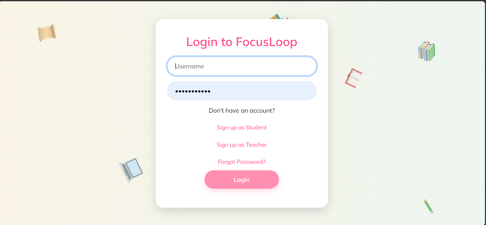

## 📖FocusLoop
Focus Loop is a web-based student leave and complaint management system that makes student’s campus life easier, faster!

## 🌟Technologies
* Django
* Python
* Bootstrap
* SQLite

## 🚀 Features
* Manages student leaves and complaints
* user authentication and registration
* **Role-based** dashboards for students and teachers
* Students can fill **anonymous** complaints and submit.
* Students acan fill **Leave form** also upload documents required for teachers to review.
* Teachers review, accept or reject the leave application.
* Teachers can update **status of complaints**  and add **remarks**.

## 🏁🏎️Running the Project
1. Clone the Repository.
2. Install Python.
3. Set virtual Environment: ```python -m venv myenv```
4. Install Django:  ```pip install django ```
5. Run Django: ```python manage.py runserver```
6. Open local host on your browser.

## ⚙️ The Process
In most colleges and campuses, students have to fill paper forms whenever they want to apply for leave or comaplaint, which are then submitted to teachers or administrative staffs, who check and approve them manually. This way of handling leave applications and complaints take a lot of time, get confusing, and sometimes forms are also lost or delayed. Students often don't know about the status of their requests.

To solve this problem we came up **"FocusLoop"** a simple web-based leave and complaint management system, that allows student to fill leave forms and submits complaints (Anonymously if required) easily, anytime from anywhere. This completely eliminates all the paper forms and letters. Students no more have to go to departments or wait for teachers in their respective departments. 

Overall, FocusLoop changes the way universities handle leave and complaints. It removes the nned for paper forms, saves time for students and staff, and ensures that every request is seen and handled correctly. The system creates a clear, easy, and fast way for students and administrators to communicate, making the university life smoother and more organized.

## 🔎 Preview
<table>
  <tr>
    <td>
        
    </td>
    <td>
       
    </td>
  </tr>

  <tr>
    <td>
      
    </td>
  </tr>

   <tr>
    <td>
        
    </td>
    <td>
       
    </td>
  </tr>

  <tr>
    <td>
        
    </td>
    <td>
       
    </td>
  </tr>

   <tr>
    <td>
        
    </td>
    <td>
            
    </td>
  </tr>

  <tr>
    <td>
   
    </td>
    <td>
       
    </td>
  </tr>

   <tr>
    <td>
        
    </td>
    <td>
       
    </td>
  </tr>
  
</table>


